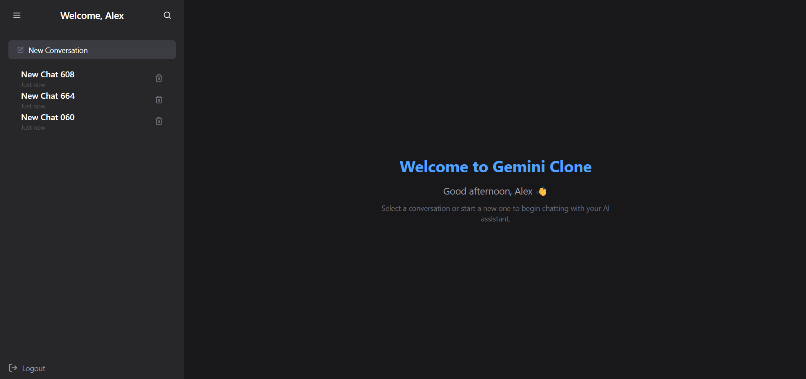

# 💬 Gemini Clone – AI Chat Application

A modern, Gemini-inspired AI chat web application built with **ReactJS**, **TailwindCSS**, **Framer Motion**, **Zustand**, and **React Router**. It features a dynamic, WhatsApp Web-like layout with an interactive chat system, animated UI, sidebar conversations, search functionality, dummy login with OTP, and session persistence.

[Live Preview](https://gemini-v3.netlify.app/)



---

## 🚀 Features

- ✅ Gemini-style layout & animations (Framer Motion)
- ✅ Modular and maintainable codebase
- ✅ Zustand state management (auth, chat, conversations)
- ✅ Session-based message persistence
- ✅ OTP-based dummy login (hardcoded)
- ✅ Sidebar with hover-collapse & animated transitions
- ✅ Create/Delete chatrooms with toast notifications
- ✅ Search chatrooms via a dedicated search route
- ✅ Mobile responsive with styled scrollbars
- ✅ Copy-to-clipboard functionality for Gemini messages
- ✅ Image attachment support for user messages

---

## 📦 Installation

1. **Clone the repository**

   ```bash
   git clone https://github.com/your-username/gemini-clone.git
   cd gemini-clone
   ```

2. **Install dependencies**

   ```bash
   npm install
   ```

3. **Start the development server**

   ```bash
   npm run dev
   ```

4. Open the app in your browser:
   ```
   http://localhost:5173
   ```

> ✅ If you want to test clipboard functionality on mobile, run the app with HTTPS using the optional `vite-plugin-basic-ssl` setup (ask if you need help setting this up).

---

## 🧪 How to Use

1. **Login Page**

   - Enter your name and phone number.
   - You’ll be redirected to an OTP page.
   - By default, logging in with any number will log you in as **Alex**.

2. **OTP Verification**

   - **Dummy OTP:** `123456` (for testing only)
   - Once submitted, you'll be redirected to the Gemini-style chat dashboard.

3. **Dashboard**

   - View conversations in the sidebar.
   - Click to open a conversation.
   - Add new conversations or delete them.
   - Search existing chatrooms via the search icon.
   - Send messages (text + image) — user's messages appear on the right with bubbles, Gemini's simulated responses appear centered with no bubble.

4. **Clipboard**

   - You can copy Gemini's response by tapping the copy icon (⚠️ works only on HTTPS in mobile).

---

## 🔧 Tech Stack

- **Frontend:** React, TailwindCSS, Framer Motion
- **Routing:** React Router v6+
- **State Management:** Zustand
- **Notifications:** react-toastify
- **Icons:** react-icons

---

## 📁 Folder Structure

```
src/
│
├── components/         // Shared UI components
├── pages/              // Route-level pages (Login, OTP, Dashboard, etc.)
├── store/              // Zustand stores
└── App.jsx             // Root app
```

---

## 📌 Notes

- 🧪 This is a frontend-only project with mocked logic (no backend).
- 🧠 Gemini responses are simulated using setTimeout.
- 🧪 OTP validation is fake — you can replace it later with real backend auth.

---

## 🛠 Future Improvements

- Replace dummy OTP with real backend auth
- Add OpenAI/Gemini API integration
- Store messages in a backend DB
- Add voice or file input options
